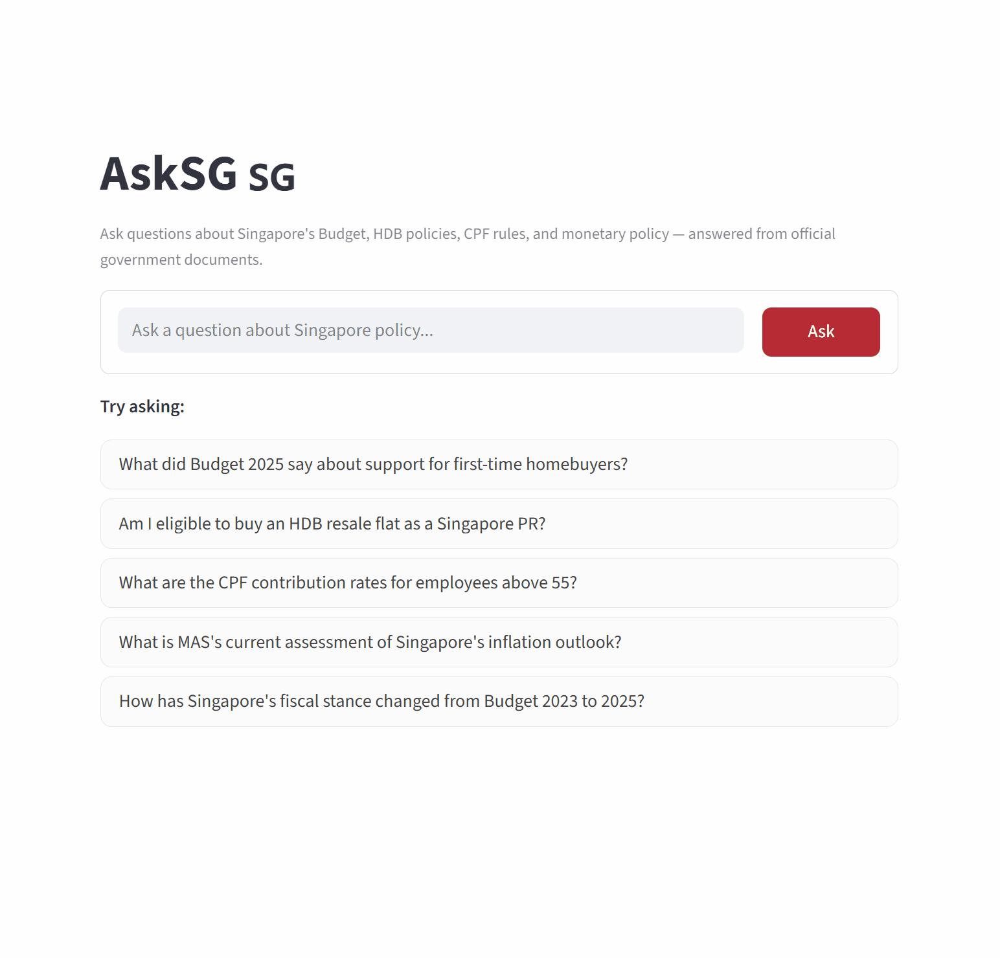

# AskSG

A Retrieval-Augmented Generation (RAG) assistant for Singapore public policy documents.

Ask questions in natural language about Singapore's Budget, housing policies, CPF rules, and monetary policy — and get answers grounded in official government sources.



---

## What It Does

AskSG lets you ask questions like:

- *"What did Budget 2025 say about support for first-time homebuyers?"*
- *"Am I eligible to buy an HDB resale flat as a Singapore PR?"*
- *"How has Singapore's fiscal policy stance changed from 2023 to 2025?"*
- *"What are the CPF contribution rates for employees above 55?"*
- *"What is MAS's current assessment of Singapore's inflation outlook?"*

Instead of reading through long government PDFs, you get a cited, grounded answer in seconds.

---

## Architecture

```
Singapore government documents
   (Budget speeches, MAS reviews, HDB guides, CPF guides)
            │
            ▼
    [ ETL / Ingestion ]          etl/fetch_documents.py
    Download PDFs + HTML
            │
            ▼
    [ Preprocessing ]            etl/chunk_documents.py
    Clean + split into
    overlapping text chunks
    (500 chars, 50 overlap)
            │
            ▼
    [ Embedding + Indexing ]     etl/build_index.py
    sentence-transformers
    (all-MiniLM-L6-v2)
    → ChromaDB vector store
            │
            ▼
    [ RAG Pipeline ]             app/rag.py
    User question
    → embed query (MiniLM)
    → BM25 keyword retrieval  ─┐
    → dense vector retrieval  ─┴─ RRF fusion (top-25)
    → cross-encoder rerank (top-9)
    → Groq LLM (Llama 3.3 70B)
    → grounded answer
            │
            ▼
    [ Streamlit Interface ]      app/main.py
    Chat interface
```

---

## Data Sources

| Source | Documents | Format |
|---|---|---|
| [Singapore Budget](https://www.singaporebudget.gov.sg) | Budget speeches 2023, 2024, 2025 | PDF |
| [MAS](https://www.mas.gov.sg) | Macroeconomic Reviews Apr/Oct 2024, Apr 2025 | PDF |
| [HDB](https://www.hdb.gov.sg) | Buying guides, resale eligibility, couples & families | HTML |
| [CPF Board](https://www.cpf.gov.sg) | Contribution rates, housing usage, OW ceiling schedule, Budget 2023 CPF highlights | HTML |

All documents are official Singapore government publications, free for public use.

---

## Tech Stack

| Layer | Tool |
|---|---|
| Language | Python 3.9+ |
| Embeddings | `sentence-transformers` — `all-MiniLM-L6-v2` |
| Keyword index | `rank-bm25` — BM25Okapi over all 2,107 chunks |
| Vector store | ChromaDB (local, persistent) |
| Reranker | `cross-encoder/ms-marco-MiniLM-L-6-v2` |
| LLM | Groq API — `llama-3.3-70b-versatile` (free tier) |
| PDF parsing | `pdfplumber` |
| Frontend | Streamlit |
| Deployment *(planned)* | FastAPI + Docker + AWS EC2 |

---

## Project Structure

```
asksg/
├── corpus/                    # Extracted text documents (tracked in git)
│   ├── budget/                # Singapore Budget speeches (3 PDFs)
│   ├── mas/                   # MAS Macroeconomic Reviews (3 PDFs)
│   ├── hdb/                   # HDB eligibility guides (3 HTML)
│   ├── cpf/                   # CPF contribution and housing guides (4 HTML)
│   └── chunks.jsonl           # 2,107 text chunks ready for embedding
├── etl/
│   ├── fetch_documents.py     # Downloads source documents
│   ├── chunk_documents.py     # Cleans and chunks text
│   ├── build_index.py         # Embeds chunks into ChromaDB
│   └── extract_local_pdf.py   # Helper: extract text from local PDFs
├── app/
│   ├── rag.py                 # RAG pipeline (hybrid retrieve + rerank + Groq generate)
│   └── main.py                # Streamlit chat interface
├── eval/
│   ├── ragas_eval.py          # Evaluation script (local NLI + cosine similarity)
│   └── test_set.json          # 10 curated Q&A pairs with ground truth
├── .gitignore
└── requirements.txt
```

---

## Getting Started

```bash
# 1. Clone and set up environment
git clone https://github.com/isafzh/asksg.git
cd asksg
python -m venv .venv
.venv\Scripts\activate       # Windows
# source .venv/bin/activate  # Mac/Linux
pip install -r requirements.txt

# 2. Add your Groq API key
echo GROQ_API_KEY=your_key_here > .env
# Get a free key at https://console.groq.com

# 3. Build the vector index (downloads ~90MB model on first run)
python etl/build_index.py

# 4. Run the app
streamlit run app/main.py
# → opens at http://localhost:8501
```

To refresh the document corpus:
```bash
python etl/fetch_documents.py   # re-download source documents
python etl/chunk_documents.py   # re-chunk
python etl/build_index.py       # re-embed (delete chroma_db/ first)
```

---

## Evaluation

RAG quality is measured on a hand-curated test set of 10 Q&A pairs drawn from the source documents (`eval/test_set.json`).

Two-tier evaluation covering the full RAG Triad (Context Relevance, Faithfulness, Answer Relevance):

| Metric | What it measures | Method | API cost |
|---|---|---|---|
| Context Relevance | Are retrieved chunks on-topic? | Cosine similarity: query vs chunks (MiniLM) | 0 extra calls |
| Answer Similarity | Does the answer match ground truth? | Cosine similarity: answer vs ground truth (MiniLM) | 0 extra calls |
| Keyword Recall | Does the context contain key facts? | Ground-truth keyword presence in retrieved chunks | 0 extra calls |
| Faithfulness (LLM) | Is every claim grounded in the context? | LLM-as-judge structured prompt | 1 call/question |
| Answer Relevance (LLM) | Does the answer address the question? | LLM-as-judge structured prompt | 1 call/question |

Total per run: **20 Groq API calls** (10 generation + 10 judge). The original Ragas library required 1,300+ calls per run and exhausted the free-tier daily quota in a single run — this implementation achieves the same conceptual coverage at 1.5% of the cost.

### Step 1 — Top-K Curve (dense-only baseline)

The eval script accepts a `--top-k` argument. Four values were tested on the original dense-only pipeline to find the diminishing-returns point:

| Metric | K=5 | K=7 | K=9 | K=11 |
|---|---|---|---|---|
| Faithfulness (NLI entailment) | 0.4449 | 0.4550 | **0.4922** | 0.4659 |
| Answer Similarity (cosine) | 0.8413 | 0.8768 | 0.8777 | **0.8906** |
| Keyword Recall | 0.7405 | 0.7664 | 0.8453 | **0.8958** |

**K=9 is the sweet spot**: faithfulness peaks here then falls at K=11 (noise from weakly-related chunks causes the LLM to synthesise beyond what any single chunk supports). Answer similarity and keyword recall keep rising, but the faithfulness drop signals retrieval quality declining. Each extra chunk adds ~130 tokens to every Groq API call, so higher K also reduces daily query capacity on the free tier.

### Step 2 — Hybrid Pipeline Upgrade (k=9)

The k-curve experiment revealed a temporal disambiguation failure on Q5 (CDC Vouchers Budget 2025): `budget_2025_speech` was absent from the top-9 retrieved chunks because dense retrieval treats same-topic chunks from 2023/2024/2025 as semantically equivalent. The fix: **hybrid BM25 + dense + RRF + cross-encoder reranking**. BM25 keyword scoring on "2025" pulls the right document into the candidate pool; the cross-encoder reranker confirms its relevance.

| Metric | Baseline (dense-only, k=9) | Hybrid (BM25+dense+rerank, k=9) | Change |
|---|---|---|---|
| Context Relevance | 0.6326 | 0.6110 | -0.022 |
| **Answer Similarity** | 0.8761 | **0.9162** | **+0.040** |
| **Keyword Recall** | 0.8453 | **0.9285** | **+0.083** |
| Faithfulness (LLM) | 1.0000 | 0.9600 | -0.040 |
| **Answer Relevance (LLM)** | 0.9200 | **1.0000** | **+0.080** |

**Q5 (temporal disambiguation) — the specific failure fixed:**

| Metric | Baseline | Hybrid |
|---|---|---|
| Answer Similarity | 0.647 | **0.939** |
| Keyword Recall | 0.588 | **1.000** |
| LLM Answer Relevance | 0.6 | **1.0** |

**Trade-off:** Q7 (HDB PR eligibility) LLM faithfulness dropped from 1.0 to 0.6 — the hybrid candidate pool introduced a noisier chunk mix for that question. A more targeted fix (metadata filter by source when the query explicitly names a document category) would avoid this regression.

*10 hand-curated Q&A pairs across Budget, CPF, HDB, and MAS sources.*

To run:
```bash
# Dense-only baseline (original pipeline)
python eval/ragas_eval.py --top-k 9 --mode baseline   # saves eval/results_k9_baseline.json

# Hybrid (BM25 + dense + RRF + rerank) — current production pipeline
python eval/ragas_eval.py --top-k 9 --mode hybrid     # saves eval/results_k9_hybrid.json
```

---

## Roadmap

- [x] Document ingestion pipeline (13 documents, 4 sources)
- [x] Text preprocessing and chunking (2,107 chunks)
- [x] Embedding and ChromaDB indexing (2,107 vectors, all-MiniLM-L6-v2)
- [x] RAG pipeline (retrieval + Groq LLM)
- [x] Streamlit chat interface
- [x] Evaluation framework: two-tier (local NLI + LLM-as-judge), 20 Groq calls/run vs 1,300+ for Ragas
- [x] Top-K curve (k=5/7/9/11): faithfulness peaks at k=9, similarity/recall peak at k=11; k=9 chosen as optimal
- [x] Temporal disambiguation diagnosed: Q5 CDC Vouchers absent from baseline top-9 due to year-agnostic dense embeddings
- [x] Hybrid retrieval: BM25 + dense + RRF fixes Q5 (answer similarity 0.647 → 0.939, answer relevance 0.6 → 1.0)
- [x] Cross-encoder reranking: `ms-marco-MiniLM-L-6-v2` re-scores fused candidates before generation
- [x] Eval `--mode` flag: `baseline` vs `hybrid` for reproducible before/after comparison
- [ ] Metadata filtering: constrain dense retrieval by source/year for targeted queries (would fix Q7 regression)
- [ ] FastAPI backend + Docker
- [ ] AWS EC2 deployment
